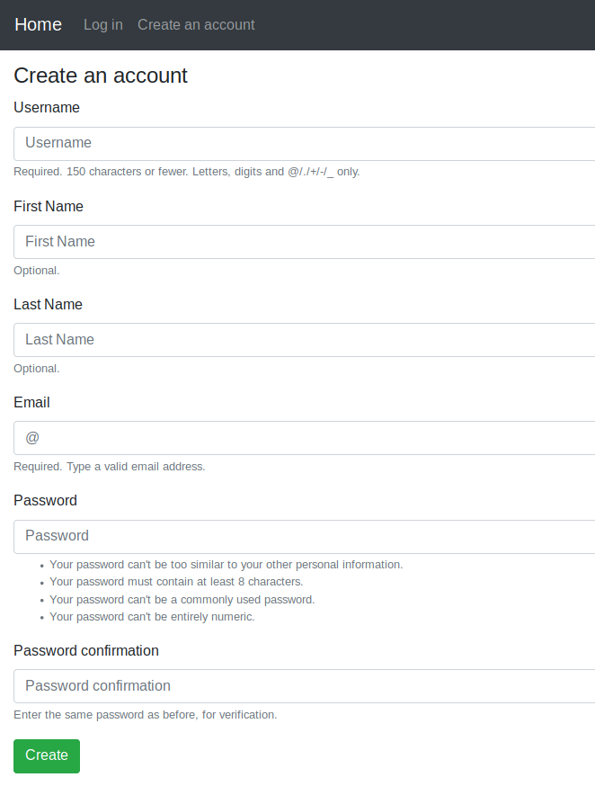

# Currency Exchange Application.

## Screenshots

| Log In | Create an account | Home page |
| -------|--------------|-----------------|
|  |  |  |

| Password reset | Set new password | Password change |
| ---------------|------------------|-----------------|
|  |  |  |

## Functionality

- Log in
    - via username & password
    - via email & password
    - via email or username & password
    - with a remember me checkbox (optional)
- Create an account
- Log out
- Profile activation via email
- Reset password
- Remind a username
- Resend an activation code
- Change password
- Change email
- Change profile
- Multilingual: English, Russian, and Simplified Chinese
- Wallet
- Transfer money from one user to another


## Installing

### Clone the project

```
git clone https://github.com/vinaybhawsar/currency-exchange
cd currency-exchange
```

### Install dependencies & activate virtualenv

```
pip install pipenv

pipenv install
pipenv shell
```

### Configure the settings (connection to the database, connection to an SMTP server, and other options)

1. Edit `source/app/conf/development/settings.py` if you want to develop the project.

2. Edit `source/app/conf/production/settings.py` if you want to run the project in production.

### Apply migrations

```
python source/manage.py migrate
```

### Collect static files (only on a production server)

```
python source/manage.py collectstatic
```

### Running

#### A development server

Just run this command:

```
python source/manage.py runserver
```
